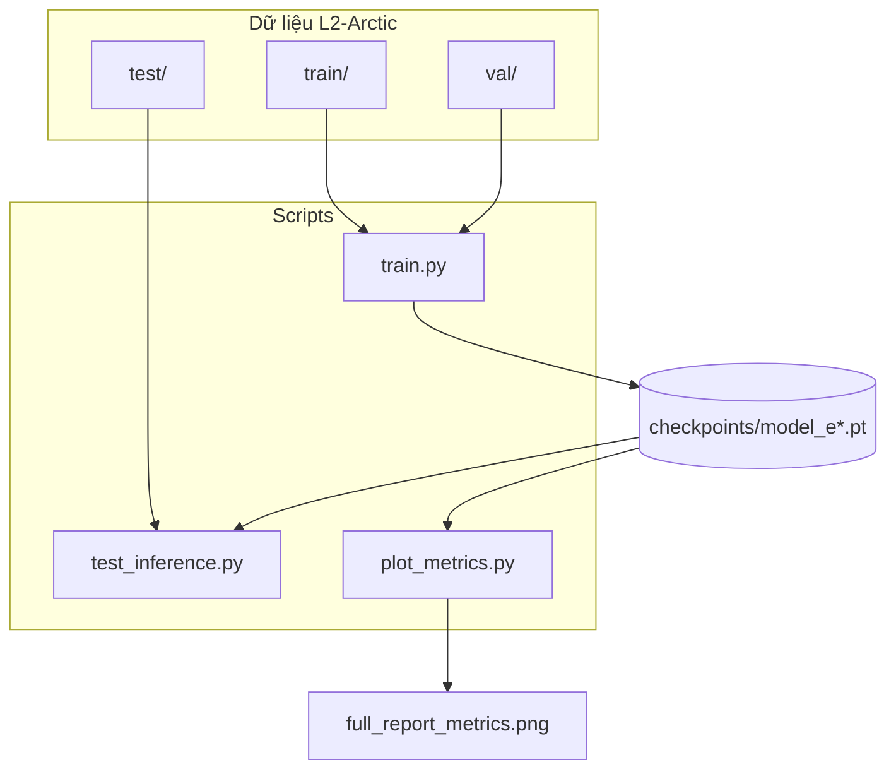
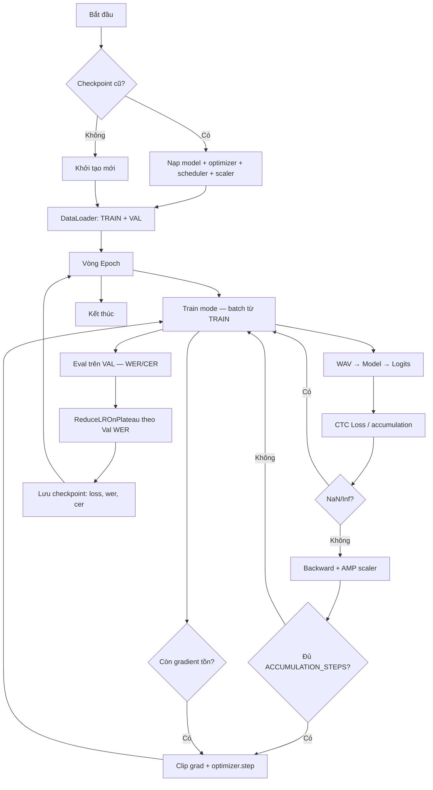
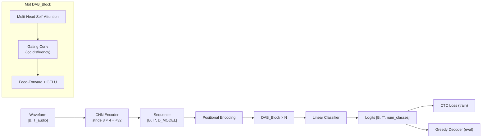
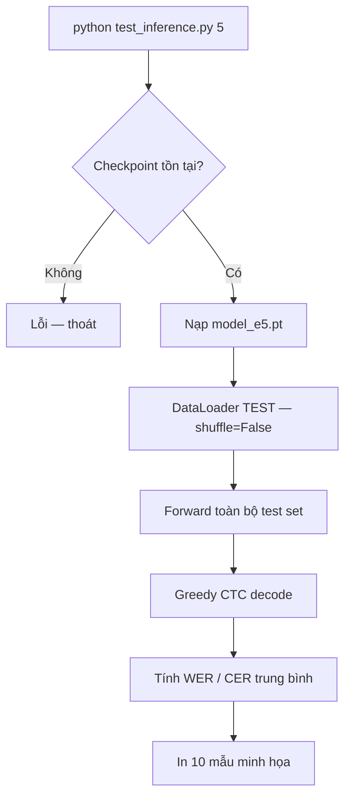

# Sơ đồ luồng — DAB Transformer (ASR + CTC)

## 1. Tổng quan dự án



## 2. Luồng huấn luyện (`train.py`)



## 3. Kiến trúc mô hình (`model.py`)



## 4. Luồng test (`test_inference.py`)



## 5. Giải mã CTC (`utils.py`)


## 6. File và vai trò

| File | Vai trò |
|------|---------|
| `config.py` | Đường dẫn train/val/test, hyperparameters |
| `dataset.py` | Đọc WAV + transcript, resample 16 kHz |
| `model.py` | DAB_Transformer |
| `utils.py` | TextProcess, CTC lengths, decode, `evaluate_metrics` |
| `train.py` | Huấn luyện CTC; metric trên **val** |
| `test_inference.py` | Metric trên **test** + mẫu minh họa |
| `plot_metrics.py` | Vẽ loss + WER/CER từ checkpoint |

## 7. Lệnh chạy

```bash
python train.py
python test_inference.py 10
python plot_metrics.py
```
